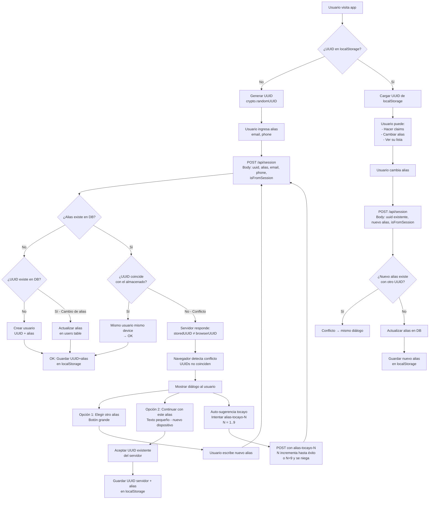

# Estrategia: UUID como Identificador (Origen: Navegador) + Alias como Texto Decorativo

## 1. Principios de la Estrategia

- El **UUID se origina en el navegador** (`crypto.randomUUID()`) — no en el servidor
- El **alias es único** en la base de datos
- El **servidor es reactivo**: valida y responde, no toma decisiones
- El **navegador decide** qué acción tomar ante conflictos
- El alias es **solo texto decorativo** de visualización

---

## 2. Diagrama de Flujo Completo



---

## 3. Flujo Detallado Paso a Paso

### 3.1 Nueva Sesión (Primera Vez en el Navegador)

1. **Browser**: No encuentra `claimit_uuid` en `localStorage` → genera `crypto.randomUUID()`
2. **Browser**: Usuario escribe alias "JuanP", email, phone
3. **Browser**: `POST /api/session` con `{ uuid: "abc-123", alias: "JuanP", email, phone, isFromSession: false }` (UUID recién generado → flag `false`)
4. **Server**: Busca alias "JuanP" (case-insensitive)
   - **No existe**: Busca si UUID "abc-123" existe
     - No existe → `INSERT INTO users (uuid, alias, email, phone)`
       - Si `isFromSession: true` (legacy post-reset BD) → añade `databaseReset: true` en respuesta + log
     - Sí existe (cambio de alias) → `UPDATE users SET alias = 'JuanP' WHERE uuid = 'abc-123'`
   - **Sí existe** con UUID "def-456": Compara con browser UUID "abc-123"
     - **Coinciden** → OK, misma sesión
     - **NO coinciden** → Respuesta: `{ conflict: true, storedUuid: "def-456", storedAlias: "JuanP" }`
5. **Browser**: Si `conflict === true`:
   - Detecta: mi UUID "abc-123" ≠ storedUuid "def-456"
   - Muestra diálogo de error con:
     - **Botón grande**: "Elige otro alias" → usuario escribe otro alias
     - **Texto pequeño**: "Continuar con este alias (nuevo dispositivo)" → browser guarda storedUuid en localStorage y continúa

### 3.2 Sesión Existente (Mismo Navegador)

1. **Browser**: Encuentra `claimit_uuid` en localStorage
2. **Browser**: Carga sesión directamente sin llamar al servidor
3. **Browser**: Usuario puede hacer claims, ver su lista, etc.

### 3.3 Cambio de Alias

1. **Browser**: Usuario hace clic en "Cambiar Alias"
2. **Browser**: Usuario escribe nuevo alias "PedroM"
3. **Browser**: `POST /api/session` con `{ uuid: "abc-123", alias: "PedroM", email, phone, isFromSession: true }` (UUID de localStorage)
4. **Server**: Busca alias "PedroM"
   - **No existe** → `UPDATE users SET alias = 'PedroM' WHERE uuid = 'abc-123'`
   - **Sí existe** con otro UUID → Devuelve conflicto
5. **Browser**: Si conflicto, mismo diálogo de "elegir otro" o "continuar"

### 3.4 Tocayo Fallback (Auto-sugerencia)

Cuando hay conflicto y el usuario elige "elegir otro alias", el navegador auto-sugiere:
- "JuanP-tocayo-2" (empieza en 2, saltándose el 1 que es el alias original)
- "JuanP-tocayo-3"
- ... hasta "JuanP-tocayo-9"

El navegador incrementa N desde 2 hasta 9 y reintenta. No se guarda contador en el servidor. Si N=9 también está ocupado, se niega el alias definitivamente.

---

## 4. API Contract — `POST /api/session`

### Request
```json
{
  "uuid": "abc-123...",          // Generado por crypto.randomUUID()
  "alias": "JuanP",              // Obligatorio
  "email": "juan@email.com",     // Opcional
  "phone": "5512345678",         // Opcional
  "isFromSession": false         // false=UUID nuevo, true=UUID de localStorage
}
```

### Response — Éxito, usuario nuevo
```json
{
  "uuid": "abc-123...",
  "alias": "JuanP",
  "email": "juan@email.com",
  "phone": "5512345678",
  "isNew": true
}
```

### Response — Éxito, usuario legacy post-reset BD
```json
{
  "uuid": "abc-123...",
  "alias": "JuanP",
  "email": "juan@email.com",
  "phone": "5512345678",
  "isNew": true,
  "databaseReset": true
}
```

### Response — Éxito, sesión existente
```json
{
  "uuid": "abc-123...",
  "alias": "JuanP",
  "email": "juan@email.com",
  "phone": "5512345678",
  "isNew": false
}
```

### Response — Conflicto (alias ocupado por otro UUID)
```json
{
  "conflict": true,
  "storedUuid": "def-456...",
  "storedAlias": "JuanP",
  "message": "El alias \"JuanP\" ya está siendo usado."
}
```

---

## 5. Cambios en Base de Datos

### Migración SQL — [`database/migrations/002_add_users_table.sql`](database/)

```sql
-- Tabla users con UUID generado por el cliente
CREATE TABLE users (
  uuid UUID PRIMARY KEY,          -- UUID generado por crypto.randomUUID() en el navegador
  alias VARCHAR(255) NOT NULL,
  email VARCHAR(255),
  phone VARCHAR(255),
  created_at TIMESTAMPTZ DEFAULT NOW()
);

-- Índice único case-insensitive para búsqueda por alias
CREATE UNIQUE INDEX idx_users_alias_lower ON users (LOWER(alias));

-- Agregar user_uuid a claims
ALTER TABLE claims ADD COLUMN user_uuid UUID REFERENCES users(uuid);

-- Backfill: crear users para cada username distinto en claims actuales
-- (Generamos UUIDs en el servidor para datos existentes)
INSERT INTO users (uuid, alias, email, phone)
SELECT 
  gen_random_uuid(),
  c.username,
  c.claimant_email,
  c.claimant_phone
FROM (
  SELECT DISTINCT ON (LOWER(username)) 
    username, claimant_email, claimant_phone
  FROM claims
  ORDER BY LOWER(username), claimed_at ASC
) c;

-- Actualizar claims existentes con su user_uuid correspondiente
UPDATE claims c
SET user_uuid = u.uuid
FROM users u
WHERE LOWER(c.username) = LOWER(u.alias);
```

---

## 6. Cambios en Backend

### 6.1 Nuevo: [`backend/src/controllers/sessionController.ts`](backend/src/controllers/sessionController.ts)

```typescript
import { Request, Response } from 'express';
import pool from '../config/db.js';

/**
 * POST /api/session
 * ...
 * El flag `isFromSession` (opcional) indica si el UUID se cargó de localStorage (true)
 * o se acaba de generar (false). Útil para migraciones futuras V1→V2 no-compatibles.
 */
export const resolveSession = async (req: Request, res: Response): Promise<void> => {
  const { uuid, alias, email, phone, isFromSession } = req.body;

  if (!uuid || !alias?.trim()) {
    res.status(400).json({ error: 'uuid and alias are required.' });
    return;
  }

  const cleanAlias = alias.trim();

  try {
    // 1. Buscar si el alias ya existe (case-insensitive)
    const aliasResult = await pool.query(
      'SELECT uuid, alias, email, phone FROM users WHERE LOWER(alias) = LOWER($1)',
      [cleanAlias]
    );

    if (aliasResult.rows.length > 0) {
      const existingUser = aliasResult.rows[0];

      // 2. Alias existe — ¿coincide el UUID?
      if (existingUser.uuid === uuid) {
        return res.json({
          uuid: existingUser.uuid,
          alias: existingUser.alias,
          email: existingUser.email,
          phone: existingUser.phone,
          isNew: false
        });
      } else {
        return res.status(409).json({
          conflict: true,
          storedUuid: existingUser.uuid,
          storedAlias: existingUser.alias,
          message: `El alias "${cleanAlias}" ya está siendo usado.`
        });
      }
    }

    // 3. Alias no existe — ¿existe el UUID? (cambio de alias)
    const uuidResult = await pool.query(
      'SELECT uuid, alias, email, phone FROM users WHERE uuid = $1',
      [uuid]
    );

    if (uuidResult.rows.length > 0) {
      await pool.query(
        'UPDATE users SET alias = $1, email = COALESCE($2, email), phone = COALESCE($3, phone) WHERE uuid = $4',
        [cleanAlias, email || null, phone || null, uuid]
      );
      return res.json({
        uuid,
        alias: cleanAlias,
        email: email || uuidResult.rows[0].email,
        phone: phone || uuidResult.rows[0].phone,
        isNew: false
      });
    }

    // 4. Nuevo usuario: UUID + alias no existen
    // isFromSession=true + UUID no existe = posible usuario legacy de V1
    const isLegacyUser = isFromSession === true;

    await pool.query(
      'INSERT INTO users (uuid, alias, email, phone) VALUES ($1, $2, $3, $4)',
      [uuid, cleanAlias, email || null, phone || null]
    );

    if (isLegacyUser) {
      console.log(`[Session] Legacy user re-created after DB reset: uuid=${uuid}, alias=${cleanAlias}`);
    }

    res.status(201).json({
      uuid,
      alias: cleanAlias,
      email: email || null,
      phone: phone || null,
      isNew: true,
      ...(isLegacyUser && { databaseReset: true })
    });

  } catch (error) {
    console.error('Session resolution failed:', error);
    res.status(500).json({ error: 'Internal error resolving user session.' });
  }
};
```

### 6.2 Modificar: [`claimsController.ts`](backend/src/controllers/claimsController.ts)

- Aceptar `userUuid` en lugar de `username` en el body
- Lookup del alias actual desde `users` para display
- Validar duplicados por `user_uuid + item_id` 
- Insertar con `user_uuid` y alias actual desnormalizado

### 6.3 Modificar: [`feedsController.ts`](backend/src/controllers/feedsController.ts)

- JOIN con `users` para obtener alias actual
- Incluir `userUuid` en cada entrada de queue

### 6.4 Modificar: [`adminController.ts`](backend/src/controllers/adminController.ts)

- Usar `user_uuid` para evicción

### 6.5 Modificar: [`index.ts`](backend/src/index.ts)

```typescript
import { resolveSession } from './controllers/sessionController.js';
app.post('/api/session', resolveSession);
```

---

## 7. Cambios en Frontend

### 7.1 Modificar: [`UserService`](frontend/src/app/services/user.ts)

```typescript
export interface UserSession {
  uuid: string;
  alias: string;
  email: string | null;
  phone: string | null;
}

@Injectable({ providedIn: 'root' })
export class UserService {
  private readonly userSessionSignal = signal<UserSession | null>(null);

  readonly session = this.userSessionSignal.asReadonly();
  readonly isAuthenticated = computed(() => this.userSessionSignal() !== null);
  readonly currentUuid = computed(() => this.userSessionSignal()?.uuid || '');
  readonly currentAlias = computed(() => this.userSessionSignal()?.alias || '');

  constructor() {
    this.loadSessionFromStorage();
  }

  private loadSessionFromStorage(): void {
    const uuid = localStorage.getItem('claimit_uuid');
    const alias = localStorage.getItem('claimit_alias');
    if (uuid && alias) {
      this.userSessionSignal.set({
        uuid,
        alias,
        email: localStorage.getItem('claimit_email'),
        phone: localStorage.getItem('claimit_phone')
      });
    }
  }

  /** 
   * Obtiene UUID existente o genera uno nuevo
   */
  private getOrCreateUuid(): string {
    let uuid = localStorage.getItem('claimit_uuid');
    if (!uuid) {
      uuid = crypto.randomUUID();
      localStorage.setItem('claimit_uuid', uuid);
    }
    return uuid;
  }

  /**
   * Indica si el UUID se cargó de una sesión previa (localStorage)
   * o se acaba de generar ahora.
   */
  private getIsFromSession(): boolean {
    return !!localStorage.getItem('claimit_uuid');
  }

  /**
   * Resuelve sesión contra el servidor.
   * Retorna: { success, conflict?, storedUuid?, storedAlias?, databaseReset? }
   */
  async resolveSession(alias: string, email: string | null, phone: string | null): Promise<SessionResult> {
    const uuid = this.getOrCreateUuid();
    const isFromSession = this.getIsFromSession();

    const response = await fetch(`${railwayApiUrl}/session`, {
      method: 'POST',
      headers: { 'Content-Type': 'application/json' },
      body: JSON.stringify({ uuid, alias, email, phone, isFromSession })
    });

    const data = await response.json();

    if (data.conflict) {
      return {
        conflict: true,
        browserUuid: uuid,
        storedUuid: data.storedUuid,
        storedAlias: data.storedAlias
      };
    }

    if (!response.ok) {
      throw new Error(data.error || 'Error al resolver sesión');
    }

    // Éxito: guardar sesión
    this.commitSession(data.uuid, data.alias, data.email, data.phone);

    const result: SessionResult = { success: true };
    if (data.databaseReset) {
      result.databaseReset = true;
    }
    return result;
  }

  /**
   * Acepta el UUID del servidor (cuando el usuario elige "continuar en nuevo dispositivo")
   */
  acceptServerUuid(storedUuid: string, alias: string, email: string | null, phone: string | null): void {
    localStorage.setItem('claimit_uuid', storedUuid);
    this.commitSession(storedUuid, alias, email, phone);
  }

  private commitSession(uuid: string, alias: string, email: string | null, phone: string | null): void {
    localStorage.setItem('claimit_uuid', uuid);
    localStorage.setItem('claimit_alias', alias);
    if (email) localStorage.setItem('claimit_email', email);
    else localStorage.removeItem('claimit_email');
    if (phone) localStorage.setItem('claimit_phone', phone);
    else localStorage.removeItem('claimit_phone');

    this.userSessionSignal.set({ uuid, alias, email, phone });
  }

  clearSession(): void {
    localStorage.removeItem('claimit_uuid');
    localStorage.removeItem('claimit_alias');
    localStorage.removeItem('claimit_email');
    localStorage.removeItem('claimit_phone');
    this.userSessionSignal.set(null);
  }
}

export interface SessionResult {
  success?: boolean;
  conflict?: boolean;
  browserUuid?: string;
  storedUuid?: string;
  storedAlias?: string;
  /** Indica que la BD fue reiniciada desde la última visita del usuario */
  databaseReset?: boolean;
}
```

### 7.2 Modificar: [`InventoryService`](frontend/src/app/services/inventory.ts)

- `ItemWithQueue.queue` incluye `userUuid`
- `submitClaim()` envía `userUuid` en lugar de `username`
- SSE handler usa `userUuid` para deduplicación

### 7.3 Modificar: Componentes UI

**InventoryList** ([`inventory-list.ts`](frontend/src/app/components/inventory-list/inventory-list.ts)):
- `isUserInItemQueue()` → compara por `userUuid`
- `onClaimItem()` → envía `userUuid`
- Handler de "Guardar Datos" → llama `resolveSession()` async

**ItemDetail** ([`item-detail.ts`](frontend/src/app/components/item-detail/item-detail.ts)):
- `isUserInItemQueue()` → compara por `userUuid`
- `onClaimItem()` → envía `userUuid`

### 7.4 Modificar: Template HTML — Diálogo de Conflicto

**InventoryList** ([`inventory-list.html`](frontend/src/app/components/inventory-list/inventory-list.html)):

El botón "Guardar Datos" ahora:
1. Llama `userService.resolveSession()` 
2. Si hay conflicto, muestra un diálogo modal con:
   - Mensaje: `"El alias '@{{ alias }}' ya está en uso por otro dispositivo."`
   - **Botón grande**: "Elegir otro alias" → limpia input y enfoca
   - **Texto pequeño**: "Usar este alias (soy la misma persona, nuevo dispositivo)" → llama `userService.acceptServerUuid()`

### 7.5 Tocayo Auto-sugerencia

Cuando el usuario elige "Elegir otro alias", el navegador auto-sugiere:

```
alias-tocayo-2   (empieza en 2)
alias-tocayo-3
...
alias-tocayo-9
```

Implementación:

```typescript
async tryTocayoVariants(baseAlias: string, email: string | null, phone: string | null): Promise<SessionResult> {
  for (let n = 2; n <= 9; n++) {
    const tocayoAlias = `${baseAlias}-tocayo-${n}`;
    const result = await this.resolveSession(tocayoAlias, email, phone);
    if (result.success) return result;
    // Si no es conflicto (otro error), propágalo
    if (!result.conflict) return result;
  }
  // Si llegamos aquí, todos los tocayo-2..9 están ocupados
  return { conflict: true, message: 'Ya hay demasiados tocayos. Elige otro alias completamente diferente.' };
}
```

---

## 8. Resumen de Archivos a Crear/Modificar

| Archivo | Acción | Cambio Principal |
|---------|--------|-----------------|
| `database/migrations/002_add_users_table.sql` | **Crear** | Tabla `users` + columna `user_uuid` en `claims` |
| `shared/types.ts` | **Modificar** | Agregar `userUuid` a `Claim` |
| `backend/src/controllers/sessionController.ts` | **Crear** | `POST /api/session` — resolución UUID+alias, flag `isFromSession`, `databaseReset` |
| `backend/src/index.ts` | **Modificar** | Registrar ruta `/api/session` |
| `backend/src/controllers/claimsController.ts` | **Modificar** | Usar `userUuid`, lookup alias desde `users` |
| `backend/src/controllers/feedsController.ts` | **Modificar** | JOIN con `users`, incluir `userUuid` en queue |
| `backend/src/controllers/adminController.ts` | **Modificar** | Usar `user_uuid` para evicción |
| `frontend/src/app/services/user.ts` | **Modificar** | UUID browser-side, `getIsFromSession()`, `resolveSession()` con flag, `databaseReset` |
| `frontend/src/app/services/inventory.ts` | **Modificar** | `submitClaim()` con `userUuid`, queue con `userUuid` |
| `frontend/src/app/components/inventory-list/inventory-list.ts` | **Modificar** | Comparar por `userUuid`, handler async con `databaseReset` |
| `frontend/src/app/components/inventory-list/inventory-list.html` | **Modificar** | Diálogo de conflicto, tocayo auto-sugerencia |
| `frontend/src/app/components/item-detail/item-detail.ts` | **Modificar** | Comparar por `userUuid` |

---

## 9. Orden de Implementación

```mermaid
flowchart LR
    A[1. Migración BD\nTabla users + backfill] --> B[2. Shared types\nuserUuid en Claim]
    B --> C[3. Backend: sessionController\nPOST /api/session]
    C --> D[4. Backend: claimsController\nuserUuid + lookup alias]
    D --> E[5. Backend: feedsController\nJOIN con users]
    E --> F[6. Backend: adminController\nuserUuid eviction]
    F --> G[7. Frontend: UserService\nUUID browser + resolveSession]
    G --> H[8. Frontend: InventoryService\nuserUuid en queue + submit]
    H --> I[9. Frontend: InventoryList\nComparar por userUuid]
    I --> J[10. Frontend: ItemDetail\nComparar por userUuid]
    J --> K[11. Frontend: HTML\nDiálogo conflicto + tocayo]
```



---

## 10. Flag `isFromSession` — Preparación para Futuras Migraciones

### Propósito

El navegador envía el flag `isFromSession: boolean` en `POST /api/session` para indicar:

| `isFromSession` | Significado |
|----------------|-------------|
| `false` (u omitido) | UUID se acaba de generar con `crypto.randomUUID()` — primera vez en este navegador |
| `true` | UUID se cargó de `localStorage` — sesión existente de una visita anterior |

### Utilidad Futura

Si en el futuro se despliega una **V2 con BD no-compatible**, el servidor podrá distinguir entre:

1. **Usuario legacy migrando** (`isFromSession: true`, UUID no existe en BD nueva)
   → El servidor sabe que es un usuario real que merece: mensaje de bienvenida, migración de datos, tratamiento especial
2. **Usuario completamente nuevo** (`isFromSession: false`, UUID no existe en BD)
   → Flujo normal de primer registro

### Implementación Actual

- **Frontend** ([`user.ts`](frontend/src/app/services/user.ts)): método `getIsFromSession()` → `!!localStorage.getItem('claimit_uuid')`, enviado en cada `POST /api/session`
- **Backend** ([`sessionController.ts`](backend/src/controllers/sessionController.ts)): acepta `isFromSession`, lo registra en logs si detecta un usuario legacy, y devuelve `databaseReset: true` en la respuesta para que el frontend muestre un mensaje informativo
- **UX**: Cuando `databaseReset: true`, el usuario ve: *"La base de datos ha sido reiniciada desde tu última visita. Tus apartados anteriores ya no existen, pero tu identidad se ha conservado."*

---

## 11. Consideraciones Técnicas

| Aspecto | Detalle |
|---------|---------|
| **UUID formato** | `crypto.randomUUID()` genera UUID v4 estándar (formato: `xxxxxxxx-xxxx-4xxx-yxxx-xxxxxxxxxxxx`) |
| **Compatibilidad** | `crypto.randomUUID()` disponible en todos los navegadores modernos. Para IE11 no soportado, pero Angular 22 no apunta a IE11. |
| **Seguridad** | No hay autenticación real. El UUID es solo un identificador de sesión. La app es privada entre amigos. |
| **SSE broadcasts** | Los eventos SSE existentes (`item_updated`) incluirán `userUuid` además de `username` para que el frontend pueda hacer matching preciso. |
| **Claims históricos** | El `username` desnormalizado en `claims` se mantiene por compatibilidad, pero el frontend siempre hace JOIN para mostrar el alias actual. |
| **Flag isFromSession** | Preparado para migraciones futuras V1→V2 no-compatibles. En V1 actual es solo informativo. |
